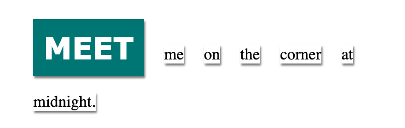
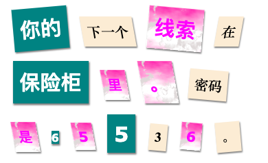

## Add class styles

Did you notice the `class=""` in the `` tags? You can use a class to style more than one thing in the same way.

\--- task \---

Add the `magazine1` class to the first `` tag.

## \--- code \---

language: html line_numbers: true line_number_start: 11

## line_highlights: 12

<

p> Meet me on

\--- /code \---

\--- /task \---

\--- task \---

Click **Run** to see the updated webpage.

\--- /task \---

You can add more than one class to an element. Just leave a space in between.

\--- task \---

Add the `big` class to the same `` tag.

## \--- code \---

language: html line_numbers: true line_number_start: 11

## line_highlights: 12

<

p> Meet me on

\--- /code \---

\--- /task \---

\--- task \---

Click **Run** again to see the updated webpage.

\--- /task \---

\--- task \---

通过在每个``中加一个字来更改消息中的字。 如果你的消息长度不同，则需要添加或删除``标记。

+ `newspaper`, `magazine1`, `magazine2`
+ `medium`, `big`, `reallybig`
+ `rotateleft`, `rotateright`
+ `skewleft`, `skewright`

Don't add more than one from each line to a ``.

\--- /task \---

\--- task \---

Click **Run** to see how your letter looks. Here is an example of how your letter could look:

\--- /task \---