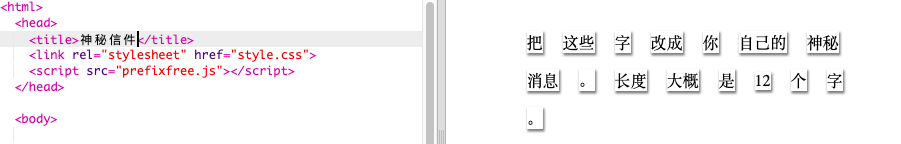
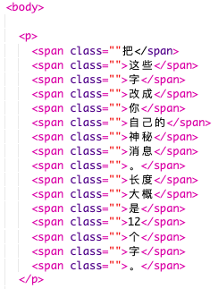
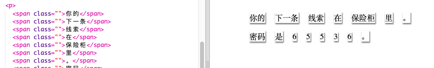

## 编辑你的信息

让我们把你的消息放到网页上。

+ 打开这个Trinket: <a href="http://jumpto.cc/web-letter" target="_blank">jumpto.cc/web-letter</a>。
    
    效果应该是这样：
    
    

+ `
`段落标签是在“生日快乐”项目中介绍的。 ``标签用于将更小的文本分组到一个段落中，以便我们设置其样式。

+ 通过在每个``中加一个字来更改消息中的字。 如果你的消息长度不同，则需要添加或删除``标记。 

+ 点击 Run 来测试你的 trinket。
    
    如果你看这些字，你会发现它们被设计成看起来就像被粘在了页面上。