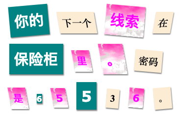

\--- challenge \---

## 挑战：设置你的信息样式

使用提供的样式使你的消息看起来像一封神秘信件。

添加这些类到你的``标签：

+ `newspaper`, `magazine1`, `magazine2`

+ `medium`, `big`, `reallybig`

+ `rotateleft`, `rotateright`

+ `skewleft`, `skewright`

不要在每行中向一个特定的``添加一个以上。

你的信件可以是这样的：

\--- /challenge \---