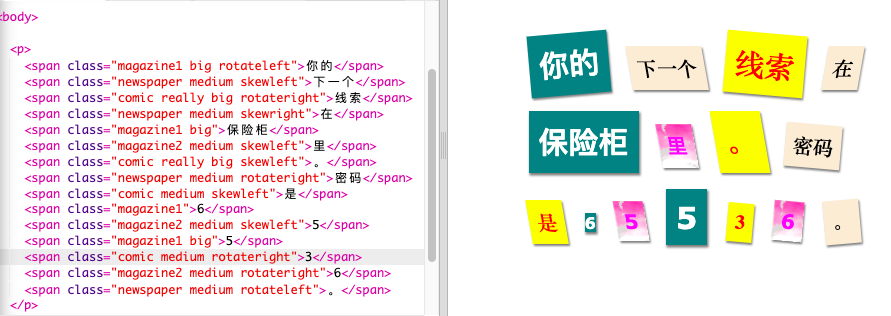
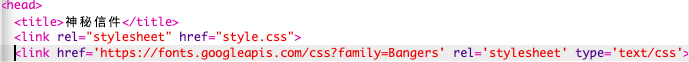
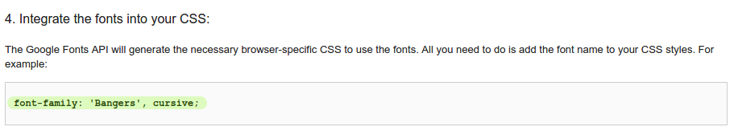
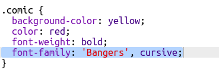
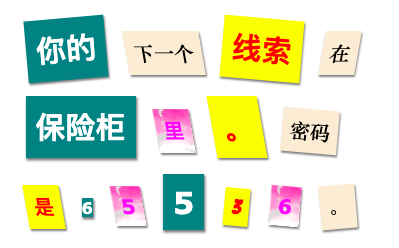

## 创建一个新类

让我们创造一个样式，它看起来像是从漫画中剪下来的。 <a href="http://jumpto.cc/web-fonts" target="_blank">jumpto.cc/web-fonts</a> 提供了很多可以免费使用的字体。

+ 把 `comic` 类加到 **style.css** 文件中。 在 `magazine2` 之后比较好。 别忘记在类名之前加一个点。 

如果你看到一个警告写着“规则是空的”，不要担心；我们一会儿就解决。

+ 现在在comic CSS类中写一些CSS。 你喜欢的话可以用不同颜色。 一系列的颜色都在这个文件中： <a href="http://jumpto.cc/colours" target="_blank">jumpto.cc/colours</a>。

+ 在HTML文件的一些``标签中使用漫画样式，并测试页面：

+ 现在你可以添加有意思的字体。 打开一个新的浏览器窗口。 进入 <a href="http://jumpto.cc/web-fonts" target="_blank">jumpto.cc/web-fonts</a> 并找到 **'bangers'**：

+ 点击 "Select this font" 按钮：

一条写着 “1 Family Selected”（选中了一个类型）的消息会出现在屏幕底部。

+ 点击 “1 Family Selected” 的消息来打开窗口并复制高亮的代码：

+ 把你刚复制的 Google 字体的 `<link>` 代码添加到网页的 `<head>`：

这样你就可以在你的网页中使用 Bangers 字体了。

+ 回到 Google字体，向下滚动页面并复制字体类型代码：

+ 在 trinket 中回到**'style.css'** 文件，把字体类型代码粘贴到漫画样式中：

+ 测试你的网页。 结果应该看起来像这样： 

