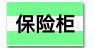

--- challenge ---

## 挑战：创建电脑打印样式

创建一个复古的计算机打印输出样式，并将其应用于一些字：

你将需要：

+ <a href="http://jumpto.cc/web-fonts" target="_blank">jumpto.cc/web-fonts</a> 中的 `VT323` 字体类型。 如果你需要如何使用Google字体的提示，可以参考第5步。

+ `computer-printout-paper.png` 背景图片。 如果你需要如何使用背景图片的提示，可以参考第4步。

--- /challenge ---