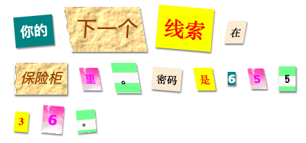

--- challenge ---

## 挑战：创建你自己的样式

现在创建你自己的类样式，让你的神秘信件更有趣。 使用你在以前的项目中学习过的CSS，也可以查看**style.css** 中的示例来激发你的灵感。

下面是一个例子：

你可以通过单击 trinket 中的 images 选项查看可用的图像。 尝试使用其中一个图像来设置图像背景：

+ `rough-paper.png`

+ `canvas.png`

如果你有 trinket 账号，你可以上传自己的图片，就像你在“讲故事”项目中做的那样。

在 <a href="http://jumpto.cc/web-fonts" target="_blank">jumpto.cc/web-fonts</a> 找到你喜欢的字体并把`<link>` 和 CSS 代码复制到你的 trinket 中。

--- /challenge ---

***
该项目由以下志愿者翻译：

齐琨

Jude Chen

正因为志愿者们的辛勤工作，我们才能为世界各地的人们提供用母语来学习的机会。您也可以通过志愿翻译工作来帮助我们吸引更多的人 - 更多信息，请访问[rpf.io/translate](https://rpf.io/translate)。